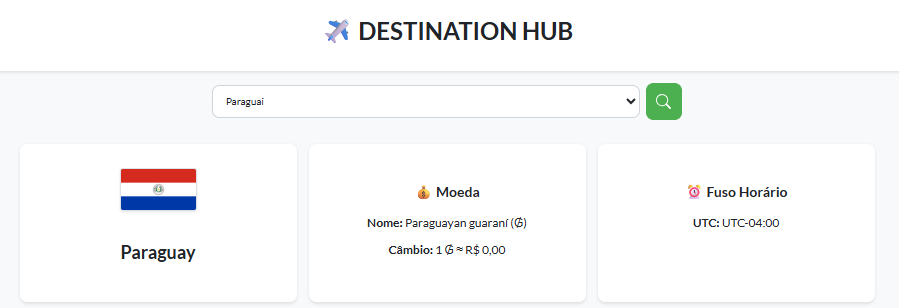

# Destination Hub

Sabe quando você vai pesquisar sobre um país e precisa abrir mil abas no navegador? Uma pra ver a moeda, outra pra notícias, outra pra saber o fuso horário... Pois é! Criei o Destination Hub pra resolver isso. É um lugar só onde você busca um país e ele te mostra tudo mastigadinho.



## O que ele faz?

- **Busca Rápida:** Pesquise por países da América do Sul e Europa.
- **Infos Básicas:** Mostra a bandeira e o nome do país.
- **Grana:** Diz qual é a moeda local e quanto ela tá valendo em Reais (BRL).
- **Que Horas São?:** Mostra o fuso e um reloginho com a hora local em tempo real.
- **Últimas Notícias:** Traz as manchetes mais recentes sobre o lugar.
- **Acesse de Onde Quiser:** O site se ajeita pra funcionar legal no PC, tablet ou celular.

## Como rodar o projeto?

Pra testar o Destination Hub na sua máquina, é bem simples. Você só precisa ter o **Node.js** instalado.

1.  **Clone o projeto:**
    Primeiro, baixe os arquivos do projeto para o seu computador.

2.  **Instale as dependências:**
    Abra o terminal na pasta do projeto e rode o comando abaixo. Ele vai instalar tudo que o "cérebro" (backend) precisa pra funcionar.

    ```bash
    npm install
    ```

3.  **Configure sua chave de API:**

    - Nesse caso, está configurada com a chave do meu perfil.

4.  **Ligue o servidor:**
    Ainda no terminal, rode o comando:

    ```bash
    node server.js
    ```

5.  **Acesse o site:**
    Pronto! Agora é só abrir o seu navegador e entrar em `http://localhost:3000`.

## Como a mágica acontece?

### Backend

Quando você pesquisa um país, ela corre pra buscar os dados em 3 fontes diferentes na internet (uma pra infos gerais, uma pro câmbio e outra pras notícias). Depois, junta tudo e manda de forma organizada pra tela que você vê.

### Frontend

Ele foi feito com o básico da web (HTML, CSS e JavaScript). Ele pede as informações pro "cérebro", e quando recebe, monta os cards com a bandeira, o relógio e as notícias.

## Espiando o código

### `server.js` (O Cérebro)

É aqui que mora a lógica do "cérebro". A principal função dele é pegar o nome do país, buscar os dados e devolver tudo junto.

#### O que ele faz:

- **`app.get('/api/country/:countryName', ...)`**: Essa é a rota principal. Ela fica esperando a "tela" pedir as infos de um país, busca os dados em 3 APIs diferentes ao mesmo tempo, junta tudo e manda de volta como uma resposta só.

### `script.js` (A Tela)

Esse arquivo faz a "tela" funcionar. Ele que cuida de tudo que é interativo.

#### Resumindo o que ele faz:

- **`fetchCountryData()`**: Quando você clica em "Buscar", essa função pega o que você digitou e pede as infos pro servidor.
- **`displayCountryInfo()`**: Assim que os dados chegam, essa função monta e exibe os cartões na tela.
- **`getLocalTime()`**: Uma função espertinha que calcula a hora local do país e faz o relógio funcionar.

## Ferramentas usadas no Backend

- `express`: Pra criar o servidor de um jeito fácil.
- `cors`: Pra permitir que o site (a "tela") converse com o servidor (o "cérebro").
- `dotenv`: Pra guardar as chaves de API de forma segura.
- `node-fetch`: Pra fazer o servidor conseguir buscar dados em outros sites.
